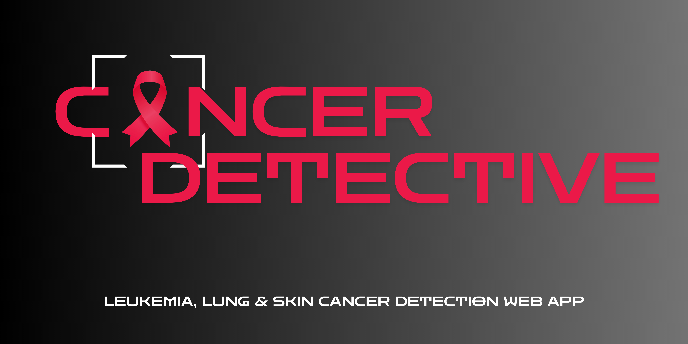

# Cancer Detective Web App



## Overview

Cancer Detective is a Streamlit web application designed to assist users in detecting different types of cancer through image analysis. The app leverages machine learning models trained on various datasets for skin, lung, and leukemia cancers, providing users with a user-friendly interface to upload images and receive diagnostic insights.

### Purpose

I created this web app for my Final Year project Proof of Concept (PoC). It aims to demonstrate the potential of machine learning in medical diagnostics and improve awareness and early detection of cancer.

## Features

- **Multi-Cancer Detection:** Supports detection of skin cancer (melanoma), lung cancer, and leukemia from uploaded images.
- **User Authentication:** Allows registration and login for both users and medical professionals.
- **Interactive Visualizations:** Provides detailed performance metrics and insights through interactive plots and matrices.
- **Health Recommendations:** Displays personalized health messages based on detection results.
- **Real-Time Model Training:** Enables users to fine-tune the model based on their inputs.

## Datasets Used

1. **Skin Cancer Dataset**
   - **Description:** Contains 10,000 images (9,600 for training and 1,000 for evaluation) for melanoma classification.
   - **Source:** [Melanoma Skin Cancer Dataset on Kaggle](https://www.kaggle.com/datasets/hasnainjaved/melanoma-skin-cancer-dataset-of-10000-images)

2. **Lung Cancer Dataset**
   - **Description:** Includes 15,000 histopathological medical images with classes: Lung Adenocarcinoma, Lung Squamous Cell Carcinoma, and Benign.
   - **Source:** [Lung Cancer Detection Dataset on Kaggle](https://www.kaggle.com/code/mohamedsameh0410/lung-cancer-detection-with-cnn-efficientnetb3/input)

3. **Leukemia Cancer Dataset**
   - **Description:** Contains 5,040 labeled medical images of cancerous and non-cancerous blood cells.
   - **Source:** [C-NMC-2019 - The Cancer Imaging Archive (TCIA)](https://www.cancerimagingarchive.net/)

## Installation

To run the Cancer Detective app locally, follow these steps:

1. Clone the repository:
   ```bash
   git clone https://github.com/yourusername/cancer-detective.git
   cd cancer-detective

2. Install the required packages:

  ```bash
  pip install -r requirements.txt

3. Run the app:
  ```bash
  streamlit run app.py

## Usage
  - Open your web browser and go to http://localhost:8501.
  - Upload images for analysis and receive detection results along with performance insights.
  - Explore various features, including interactive plots and health recommendations.

## Contributing
Contributions are welcome! If you have suggestions for improvements or features, feel free to create a pull request.
  
