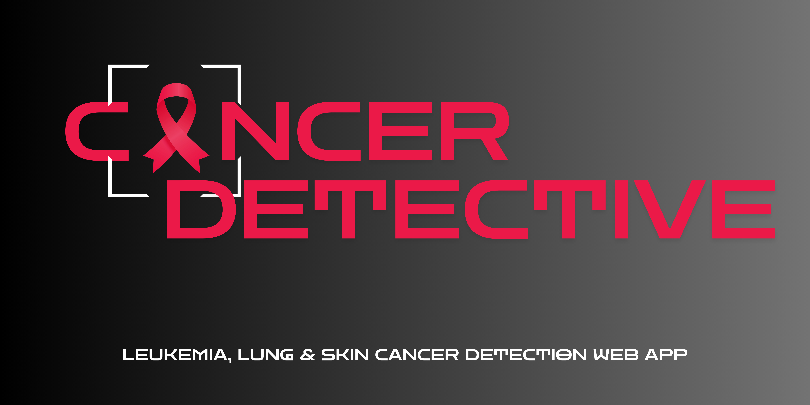

# Cancer Detective Web App      
Cancer Detective is a Streamlit web application designed to assist users in detecting different types of cancer through image analysis. The app leverages machine learning models trained on various datasets for skin, lung, and leukemia cancers, providing users with a user-friendly interface to upload images and receive diagnostic insights. 

You can explore Cancer Detective live on Streamlit: 
https://cancer-detective.streamlit.app/ 🌐
  
### Purpose
I created this web app for my Final Year project Proof of Concept (PoC). It aims to demonstrate the potential of machine learning in medical diagnostics and improve awareness and early cancer detection.

## Features
- **Multi-Cancer Detection:** It supports the detection of skin cancer (melanoma), lung cancer, and leukemia from uploaded images.
- **Interactive Visualizations:** Provides detailed performance metrics and insights through interactive plots and matrices.
- **Health Recommendations:** Displays personalized health messages based on detection results.

### Home
On the Home page, users get an overview of what the web app offers. The application is designed to help detect skin cancer by analyzing skin images. With this app, users can:
- Upload images of skin lesions for analysis. 📸
- Visualize detailed metrics about the model’s performance. 📊

### Detection
The Detection page allows users to detect skin cancer through two methods:
- **Upload Images**: Users can upload skin images from their device for analysis. 📤               

### Visualizing
The Visualizing page provides various metrics and visual aids to understand the model's performance:
- **Test Accuracy**: Displays the final accuracy on the test dataset. 🎯
- **Training and Validation Accuracy**: Shows the model's performance improvement with each epoch. 📈
- **Loss Metrics**: Tracks the reduction in loss throughout the training process. 📉
- **Confusion Matrix**: Provides a visual representation of the model’s classification results. 🧩                    

## Datasets Used

1. **Skin Cancer Dataset**
   - **Description:** Contains 10,000 images (9,600 for training and 1,000 for evaluation) for melanoma classification.
   - **Source:** [Melanoma Skin Cancer Dataset on Kaggle](https://www.kaggle.com/datasets/hasnainjaved/melanoma-skin-cancer-dataset-of-10000-images)

2. **Lung Cancer Dataset**
   - **Description:** Includes 15,000 histopathological medical images with classes: Lung Adenocarcinoma, Lung Squamous Cell Carcinoma, and Benign.
   - **Source:** [Lung Cancer Detection Dataset on Kaggle](https://www.kaggle.com/code/mohamedsameh0410/lung-cancer-detection-with-cnn-efficientnetb3/input)

3. **Leukemia Cancer Dataset**
   - **Description:** Contains 5,040 labeled medical images of cancerous and non-cancerous blood cells.
   - **Source:** [C-NMC-2019 - The Cancer Imaging Archive (TCIA)](https://www.cancerimagingarchive.net/)

   
## Getting Started

### Prerequisites
To run this web app, you need to have the following installed on your machine:
- Python 3.x
- Streamlit
- TensorFlow
- OpenCV
- Matplotlib
- Numpy
- Pandas

### Installation
Clone the repository:
   ```sh
   git clone https://github.com/your-username/skin-cancer-detection-web-app.git
   cd skin-cancer-detection-web-app
   ```
## Requirements

Before running the app, please ensure you have created a virtual environment (`.venv`). Follow these steps to set up the environment:

1. **Create a virtual environment:**
   ```bash
   python -m venv .venv
   ```

2. **Activate the virtual environment:**

    On Windows:
     ```bash
     .venv\Scripts\activate
     ```
   On macOS and Linux:
     ```bash
     source .venv/bin/activate
     ```

4. **Install required packages:**
   ```bash
   pip install -r requirements.txt
    ```

### Running the App
To start the web app, navigate to the project directory and run:
```sh
streamlit run app.py
```

## Contributing
Contributions are welcome! Please fork the repository and create a pull request with your changes.
